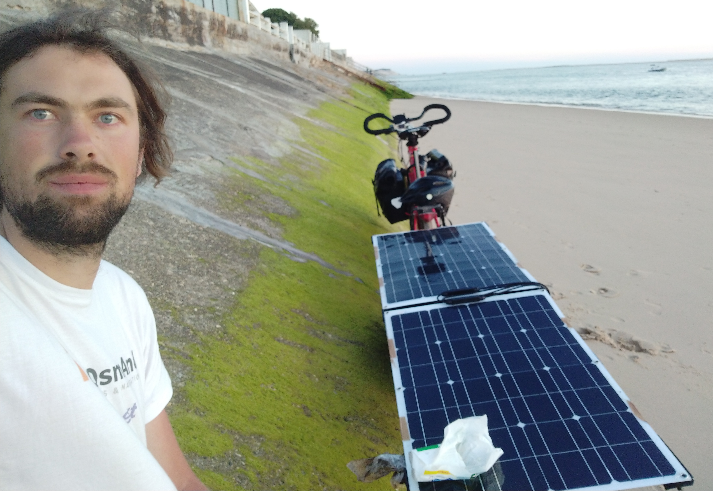
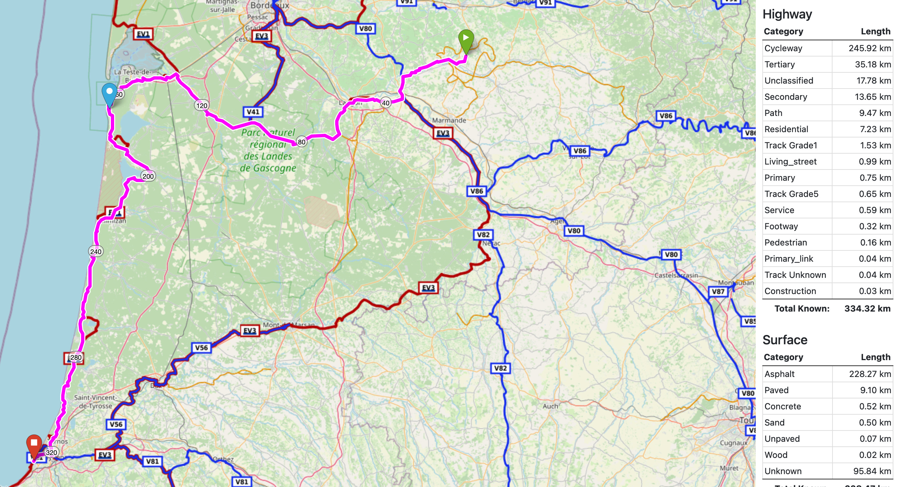

## Overview

I've built a solar charged ebike rig, with the aim of being able to go further, faster, and with less effort. This is a short write-up of what went into it. Questions? Send an email to the adress listed at left or in the menu.

Unfortunateley I don't have photos of everything, nor the buld process :-(

## Build

Components for the solar trailer:

* A heavy steel-framed, single wheel bike trailer (8.5kg for just the unmodified trailer), with a DIY frame to hold up the solar panels, made of aluminum square tubes, held together by 3D-printed spacer blocks, then a bolt (with a big washer) through the spacer block and the square tube(s) to clamp it together.

* 4 100w flexible solar panels; two exposed while riding, with two more tucked underneath and deployable when stopped. 1.2kg each according to the manufacturer.

* 1 solar charge controller, from China, which can be found by searching for _CTK-EV300_ This is a "boosting" model, meaining it takes the lower voltage produced by the solar panels (~30v), and "boosts" it up to the ~50v required for charging the battery pack. It works quite well, although not optimal for rapidly passing / varying shade.

And the bike I already had was a self-built eBike conversion with:

* TSDZ2 motor. more about that below, too.
* Slightly tired 1000wh battery (48v)
* Built on a Rockrider 540 bike (mid-range hardtail MTB). Front and rear racks additionally bodged on, custom battery box, nice saddle and and handlebars added, etc.

It took quite a while to build this, the most time consuming part being the frame for the solar panels, since it took a lot of trial and error to get all the 3D printed connectors right and angled correctly. 

I also designed a custom connector for the trailer to attach to the bike, since I didn't quite trust the fragile looking extended quick-release skewer the trailer came with. The custom connector design was a pair of "split" 3D printed blocks with space inside, modelled to fit precisely around the seatstays of the bike, those blocks then being clamped in place from either side with steel plates, and then the trailer hooking onto the steel plates (sorry, no photos for now..). So far no issues with this.

## Test trip

I did a 5 day trip to test this setup, in south-west france. Two days out, one rest day (aka lie-on-the-beach-and-do-nothing day), then two days back on the same route. I deliberately picked a week with near uninterrupted sunshine (this is important!), and a route that is nearly completely flat. The approximate route, resulting in aprroximately 160km per day: 

Exclusively done using solar power, and only wild camping.

During the test trip, everything actually worked, and nothing broke! It gave me a significant daily range boost (making 160km feel like I've only pedalled 60). With a bonus of not having to worry about phone or lights charging (provided from the main power system), and way more capacity for stuff in the trailer.

## Limitations

With the benefits, there's also some drawbacks:

### Weather dependency

You think you're dependent on the weather with a "normal" bike touring set up? Well, you're even more dependent on the weather with this. For me it resulted in constantly looking at the weather forecast and the battery remaining percentage.

**First**, even on perfect weather days, I needed to plan my riding around the sunshine hours, since the solar energy collected during riding is very low. This is due to the fact that even partial shade (from myself, surrounding trees, imperfect panel angle...) reduces the output of the panels significantly, and in addition, after brief partial shading of the panel, the charge controller takes a while to "recover" before it produces full charging power again. A more expensive controller (such as Genasun) may be better in this regard, but the limitation of shading is still there. 

Additionally, while riding I only have 200w of solar panels exposed, whereas when stopped, I can unfold 200w more, thus having an even stronger incentive to stop and charge:

**Second**, the need for sunshine means that on cloudy days, there's no power. This thing was heavy and quite a slog to pedal without electric assist.

### Power budgeting is essential

To make the most of this, a bit of effort is required to "budget" and plan for required power consumption in advance. Some stats I figured out about my setup:

* Energy use for travel is about 10wh/km, with the trailer and bike fully loaded (the opensource firmware of the TSDZ2 motor can tell me this). With this information, I know that I theoretically have about 100km of no-sun range, which is approximately what I see in reality, too.

* Given that energy collection while moving is very low, I know that I will have to stop after approximatly 100km. This resulted in the optimal day for me being:
    * Start the day (7am) with a 50% full battery, and cycle for about 30kms before breakfast (I'd try to have some "safety margin" power always available).
    * Stop to charge (8:30am), while having breakfast and then wait for two hours (unlimited phone charging is great...). Given that my solar panels are 400w in total, they will give approx 300w in reality (this is normal with solar), this will almost charge my 1000wh battery in about 3h.
    * Keep going for a bit (11:30am), adding about 70kms
    * Stop for lunch (3pm), and more charging.
    * Keep going in the evening

A second battery to bring the total capacity up to 2000wh would add more flexibility, and also allow to benefit more from overnight mains charging at campsites or similar.

Also required is looking at the weather forecast, in particular the daily sunshine hours and times, and planning during the days before. 

I think 400w of solar and 1000wh battery is about the minimum for a solar set-up. For a very approximate idea of how far you can go with your set-up, [there's a helpful calculator spreadsheet here](https://endless-sphere.com/forums/viewtopic.php?f=6&t=94721&p=1406135#p1408723)

### Day to day limitations

* It's bigger and more cumbersome: meaning that some trails that I would have taken with just the bike now become unavailable. Not just rougher trails, but narrow gates (sheep barriers..), steps, even barriers on cycle paths become annoying.

* No trains with this: on a subsequent trip, there was an offer of all regional train tickets for 1€ in France, so I hopped on and did something completely different than what I'd planned. Not possible with this.

### Stuff that can go wrong

The motor I'm using is known for not being particularly reliable, so I ended up taking a whole bag of parts, including a conventional crankset and installation tools to put on the bike in case the motor would fail in a way that left me without being able to pedal **or** use the electric assist, which is actually a possible failure mode of the TSDZ2. But I didn't need to use it.

If I were to put further work into something similar, I'd probably want to have a more reliable set-up:

* More reliable motor; i.e. Bafang. I've already had several failures with the TSDZ2 that required disassembly (heavy tools needed), and ordering parts from China (two week wait). It also overheats quite fast on warm days; even when capped at 250w max power it gets too hot. The maximum continuous power it is able to do on a 35c day seems to be about 200w. But to make up for it, it feels really nice to ride, and there is [awesome custom firmware](https://github.com/OpenSourceEBike/TSDZ2_wiki/wiki) that adds lots of nice features not available on anything else.

* Dual motor, or dual-everything setup. It could be possible to add a hub motor to the trailer (a small e-scooter type wheel), plus two (smaller capacity) batteries, and two solar charge controllers. Both drive systems would operate simultaneously (batteries and chargers in paralell, motors maybe too?) With this, all electrical failure modes are covered, and it would be possible to switch over to the functioning drive system with only a minor reduction in performance in case of failure on one.

Secondly, there's just more mechanical stuff to go wrong: trailer, trailer frame, one more wheel for punctures, more load and stress on the bike..

## Conclusion

For now I'm travelling on a conventional bike...

### Future improvements or changes

* More reliable motor set-up, as described above
* On board laptop charging: from China there is a DC to USB-C charger unit, which would allow me to power my laptop from the on board power. 13" MacBook Pro uses about 10w (which would give about 100 hours of runtime off my battery) during web browsing or coding, thus making it possible to have a truly off-grid remote, anywhere work setup.
* Less heavy set-up:, this could come in the form of a conventional ebike without trailer, and instead packing the solar panels on the bike. There are off-the-shelf foldable panels up to 300w, which I think would be just about the minimum. This would give access to trains, rougher trails, and narrow spaces.
* Or a more heavy set-up, with a trike and a "solar roof" design. The advantage of this is more space to carry stuff, and the ability to just stop and charge without having to unpack solar panels.

To be continued..