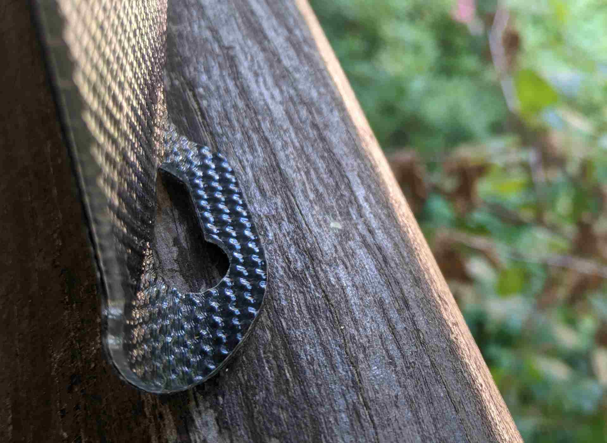
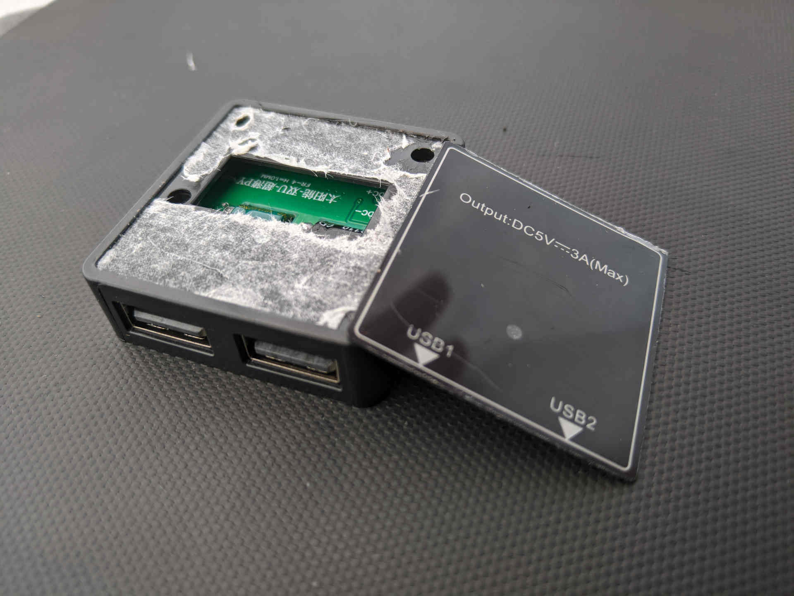
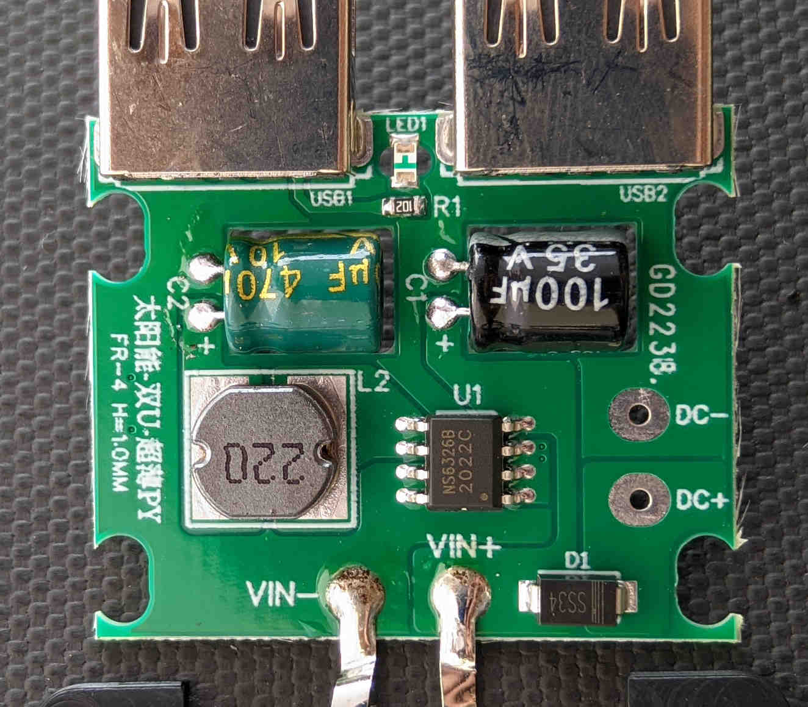
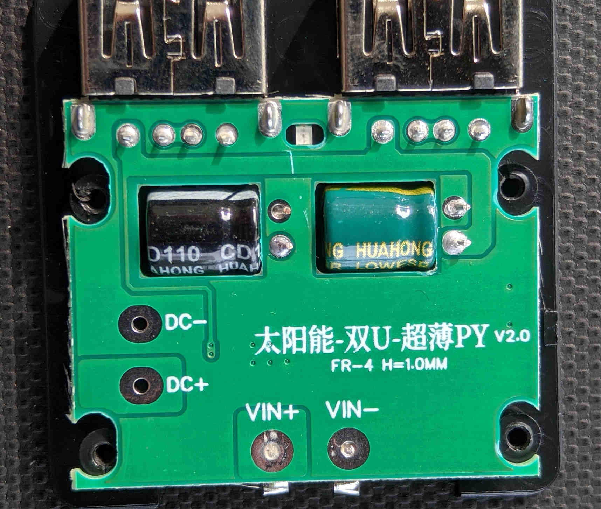

# Review of the 15w ETFE USB panel

I've recently bought a small solar panel for USB charging, primarily for bicyclecycle touring. Since I have not seen any other reviews or information about this style of panel, or even a good general description of how they work, this is it.

I bought this one because it seemed to be made of the newer ETFE material (which is supposedly more durable). It has a dimpled, textured surface just like other panels that you can find by looking for "ETFE". It is branded "Folding", although there are many brands and listings for it, as is typical with generic producs from China.

It was much heavier than I expected, mine weighs 338 grams. (For comparison, various panels that are advertised at 10w, [such as the more common "Lixada", are around 100 grams](https://threepointsofthecompass.com/2021/07/31/gear-chat-lightweight-solar-panels/)). So don't buy this if you care about weight. It measures approximately 360x215mm.

The inner area where the cells are is quite stiff, and feels sturdy and durable. It seems like the cells are mounted onto a plastic backing plate, and then the the entire assembly is encased in the outer ETFE layer. Unfortunately this inner stiff backing does not extend around the hanging eyelets at the corners, which means that they seem quite flexible (and flimsy) compared to the rest of the panel. I am quite sure that these corner eyelets will tear if used to hang the panel in an outdoor environment or a backpack. It came with suction cups, which implies the intended purpose of the eyelets is to mount it to a window or vehicle windscreen. Here's me pusing the corner of the panel to show how it, while the panel itself does not:

In some quick testing, on a very sunny day in France, I was able to get around 6w, which suggests to me that in reality it is a 10w panel. It was advertised on AliExpress as being 15w.

The USB module seems to be decently well glued on, however other similar panels are known for it falling off, so I would still exercise caution (those fragile eyelets will fit a USB cable through, and can thus provide strain relief). The ports are "right way up", meaning the screen of a USB meter would face the back of the panel, meaning you cannot see what it shows.

It can be opened by prying off the top plastic sheet, and removing 4 screws holding the top cover on. The top cover has a 3d-printed look, despite being injection molded. Perhaps a 3d printed part was used to make the initial mould:

Inside, the circuit board is very simple, with all all components on the top.: 

* An NS6326 switching regulator, 4-30v input, fixed 5v output, with it's associated inductor, and input and output capacitors. It mostly matches the datasheet schemtic.
* An indicator LED + resistor, powered form the 5v output
* An unpopulated, unused DC output connector, providing the full voltage of the panel (through a diode which is unused, in this case). I the diode is populated likely  despite being unneeded, since pick and place for a single version of the board which can also include the DC out connector, is cheaper than two versions, even with the "wasted" diode.
* Two USB ports. The data pins are shorted together. The USB ports feel OK, quality-wise, though not amazing.

The back side is completely devoid of components. There is a hole cut in the PCB to accommodate for each capacitor, even though there is enough vertical space in the case. This is perhaps another cost-cutting measure, since the PCB milling is essentially free during manufacture, and having a defined place for the capacitor to sit into can make hand-soldering quicker (and they do indeed look hand soldered):

I will update this review once I've used this charger for some time, once I've seen how durable (or not) it is.

# How do these USB solar panels work, anyway?

Pretty much every small direct-to-USB solar panel uses the same basic formula:

* Solar panel with an open circuit voltage of around 6v.
* A buck converter providing 5v output to the USB ports.
* On fancier models, sometimes an additional IC or timer to periodically power-cycle the output, absent on this one.

So why the 6v panel, with 5v buck converter? Because solar panels inherently have a voltage-current curve: the more current you draw from a solar panel, the lower the voltage will become. Usually the curve looks something like this:

![Current-voltage curve(Current-voltage-IV-curve.png)

This is why MPPT ("maximum power point tracking") battery chargers exist: they can regulate how much current they take from the panel, in order to not take too much current (thus making the voltage & power output collapse), or too little.

With USB, we don't have quite so much luxury: USB devices always expect 5v, however, this does happen to be pretty close to the maximum power point of a typical 6v-max panel, making it a good choice. 

The function of the buck regulator is to protect the device from the 6v (or more) the solar panel produces when not under load, for example when the device has finished charging. When the device is not charging, the buck regulator will be active, and will provide a regulated 5v on the output to ensure the device is happy.

However, USB devices do do something that happens to make them able to charge from solar: they do indeed have a sort of MPPT algorithm built in.  A device, when plugged into any USB charger, will slowly ramp up it's charging current, until the input voltage drops too much (and crappy chargers, or long cables, do indeed drop the voltage when reaching the maximum current they can provide). The device that's charging  monitors this while ramping up it's charging current, and once it's found the maximum the charger will provide, it backs off by a little bit, and continues charging. 

The solar panel charger behaves in the same way: It'll provide a steady 5v (thanks to the regulator) while the device ramps up it's charging current, and once the maximum current that the panel can provide is reached, the voltage will begin to drop below 5v, (and the regulator will no longer be regulating and instead will be passing the input voltage though). The device notices the falling voltage, backs off a little bit on the charging current, and has hopefully found the optimal charging current.

Often, this works quite well, however a few things are needed for it to work:

* A buck regulator which can pass the full input voltage thorough, when it falls below the 5v output regulated voltage. This is advertised in data sheets as "100% duty cycle", and the NS6326 does indeed fulfill this. There is a slight efficiency loss, since the regulator's inductor, and switching transistor will have some resistance, even when switched on 100% of the time and passing the input voltage straight through. I'd guess that our low-cost solar charger might have maybe 0.3 ohms of resistance added, leading to about 0,4w lost at full charging current. Poor quality, or long cables can loose another 0.4w, thus in the worst case of charging in full sun, with a long cable, we might be loosing almost 1w of power. However at lower currents the loss will be less.
* A USB device that has a good current-ramp-test-backoff-retry algorithm. Most devices will correctly find the maximum charging current when first plugged in, and then when a cloud is temporarily blocking sunlight, will back off the charging current. However, not all devices will then try to ramp up the charging current again once the sun is back, and instead stay at that lower charging current, either forever, or for a long time. Hence more expensive charger designs sometimes having an additional IC which periodically power-cycles the output, thus forcing the device to find the optimal charging current again. Power banks often do a better job at this than phones do, hence solar panel manufacturers frequently recommending to charge a power bank, and not your phone. A "USB power meter" can be very useful for troubleshooting, or even an app such as [AccuBattery](https://play.google.com/store/apps/details?id=com.digibites.accubattery) which can tell you your phone's charging current.
* A device that does not waste power when it (re)starts charging: some android phones turn on the display when initially connected to the charger, and on a cloudy day, or while moving in and out of shade, this could happen repeatedly.

Some improvements that could be made to this design of charger: 

* Using a buck regulator which is set to output a little more than 5v, such as 5.25v which is allowed by the USB standard, and would possibly improve some device's behaviour, as well as improving performance with long cables.
* Adding an output-power-cycling IC that some other chargers have
* A completely different design: instead of using a buck converter for limiting the output to 5v, it's possible to use a zener diode, or zener diode + transistor to limit the voltage to 5v. This will be more efficient (no losses in the inductor or switching regulator), but a little more unsafe, since failure of the diode or transistor would expose the device to the full voltage of the panel.

Perhaps in a future post I'll design an improved USB module for this style of charger.
