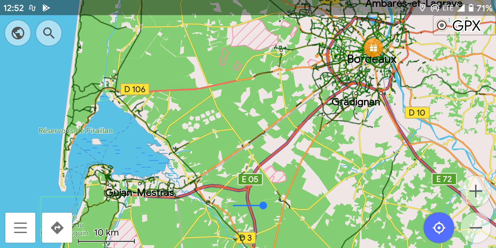
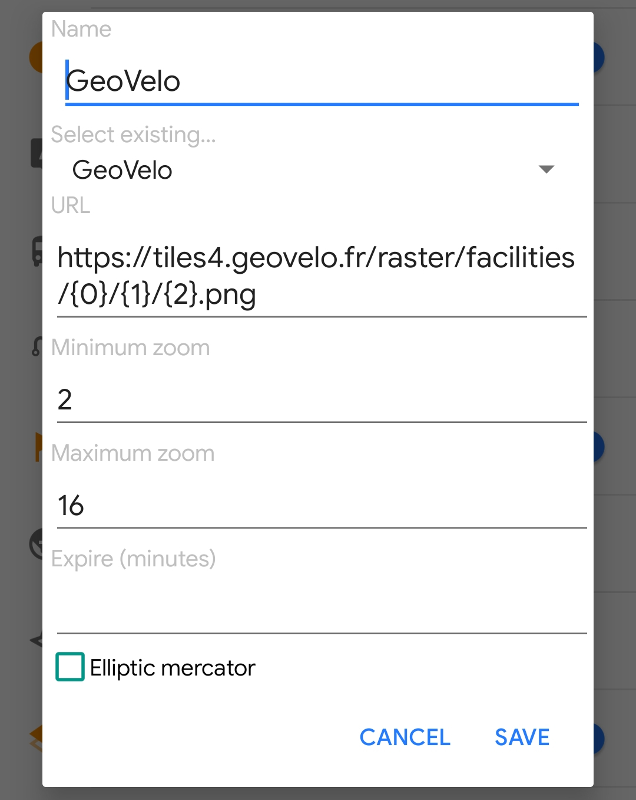

**2025 update:** OsmAnd now offers this without having to manually enter the URL, go to configure map → overlay map → on → overlay map (source) → add more → choose "GeoVelo" → apply → then just turn it on.
**2022 update:** this still works; however the OsmAnd interface looks slightly different now.

I’ve recently come across GeoVelo, which offers a map which clearly shows cycling infrastructure even when zoomed out to a country-level overview, which is a great way to have an overview for trip planning, which is’t possible with the offline OsmAnd maps, since cycleways are only shown when zoomed in far enough in OsmAnd. Even with a custom rendering.xml it’s still not possible to get an overview of cycle infrastructure on a country or region level, due to the way the cycleway information is baked into the offline map files. (Side note: GeoVelo also offers their own app - no offline functionality however)

But - the GeoVelo tiles can be used as an overlay in OsmAnd, to offer an overview, even when zoomed out - it can even be combined with the above mentioned customized rendering.xml for close zoom levels, and the online GeoVelo maps when zoomed out (OsmAnd will cache the tiles for offline use).

Anyway, here’s what it looks like:

And, how to set it up:

In OsmAnd, go to “Configure map”, then “Map source…”, “Define/Edit…”, and enter the following details:

* Name: GeoVelo (or anything you want)
* URL: https://tiles4.geovelo.fr/raster/facilities/{0}/{1}/{2}.png
* Maximum zoom: 16
* Minimum zoom: 2

After that, just enable “Overlay map”, and set it to “GeoVelo”. You might also need to set “map source” back to “Offline vector maps” if OsmAnd changes to only the GeoVelo overlay.

The map legend is available at GeoVelo, but, tl;dr: the dark green lines are dedicated cycleways, light green ones are shared, road cycle lanes.

Have fun!
