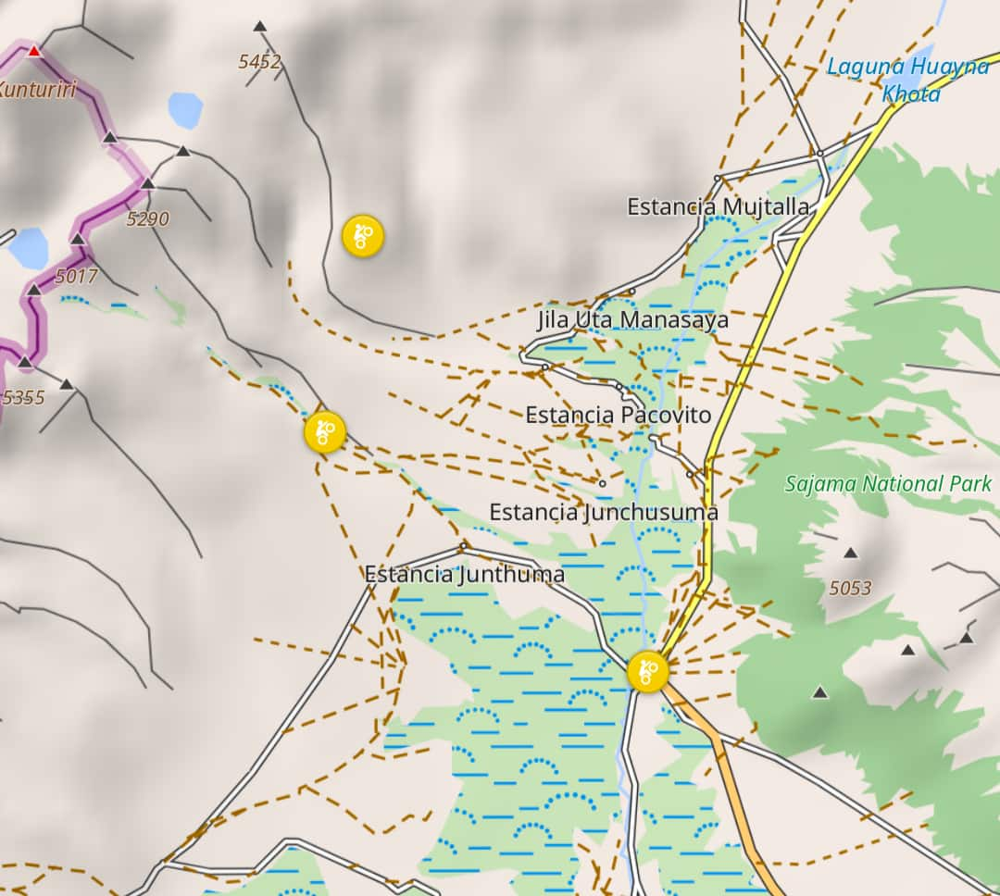

For my next big bike trip, I've been collecting interesting places that I might want to visit, using Google Maps. Now, I'd like to import them into OsmAnd, my offline navigation app of choice. OsmAnd can import GPX files, however Google maps won't let you export your saved places in a usable format such as GPX, which I'm guessing is because they'd rather you not leave Google Maps and take your data with you.

There is however Google Takout, which does offer a CSV file with links to Google Maps and not much else. This needs to be converted to a GPX file with coordinates to be able to use it with another app such as OsmAnd.

**1.** Go to [Google Takeout](https://takeout.google.com/), then choose "deselect all" at the top of the list (to ensure you're only getting your Maps data), then select "Saved" (Not any of the other "Maps" related items). Proceed with the Google Takeout export, at then end you'll be emailed a zip file containing a "Saved" folder, with a csv file inside for each of your place lists.

**2.** Upload this csv file to [https://exportgooglemaps.com/](https://exportgooglemaps.com/). Disclaimer: This isn't my service, and it doesn't have a privacy policy that I can see, so it's up to you weather you trust it with your places.

Pick "JSON" when you download after it finishes.

**3.** Upload the resulting JSON file below, to convert it to a GPX file. This one works locally in your browser and doesn't send your data anywhere. You may give them a name using the "category" field, this will group the places together as one folder in OsmAnd, otherwise they will be in separate folders based on how Google Maps has categorized them.



Once you have your GPX file, go to "My Places" in OsmAnd and choose + (add), and pick the GPX file you downloaded above, and now your saved places should be available in OsmAnd:

.

I hope this helps someone in their travels!