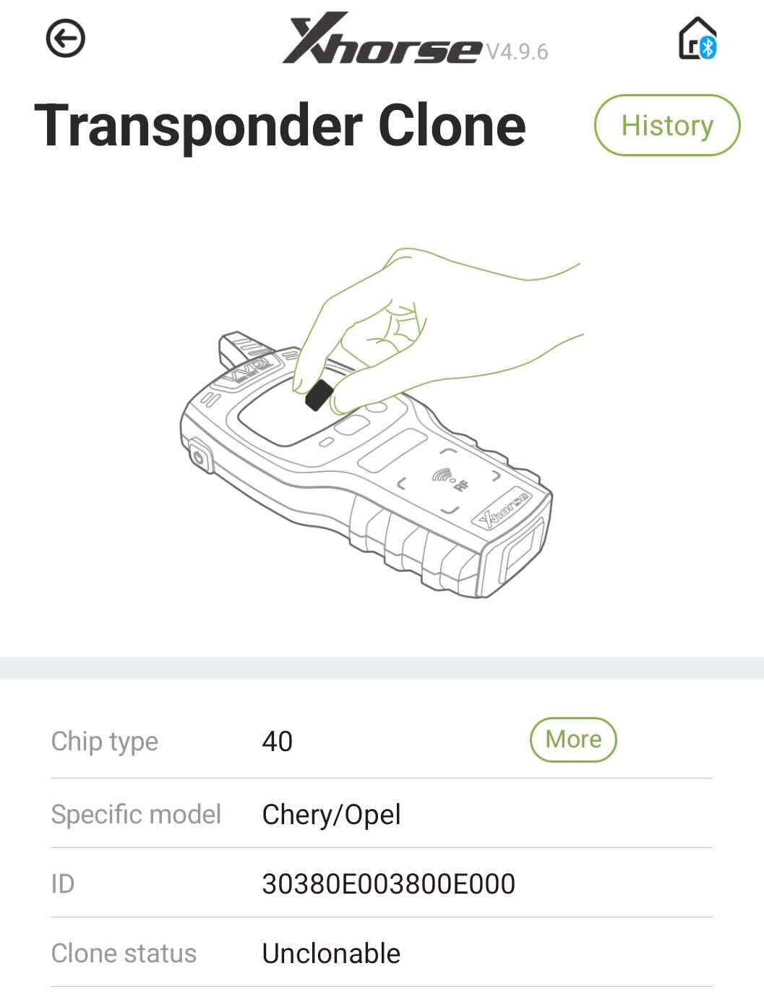
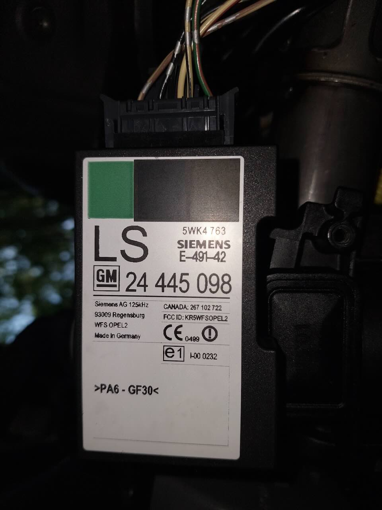
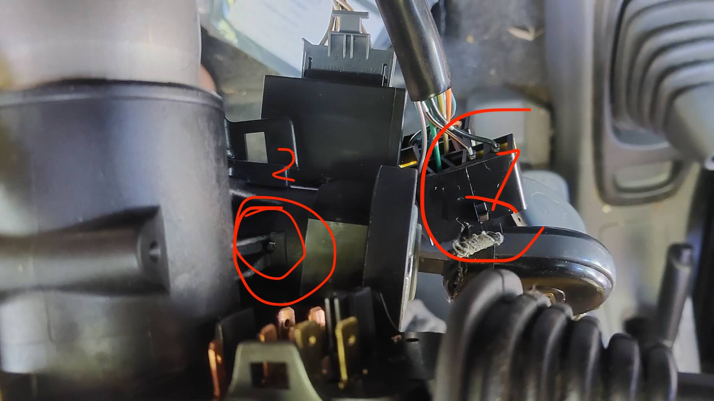
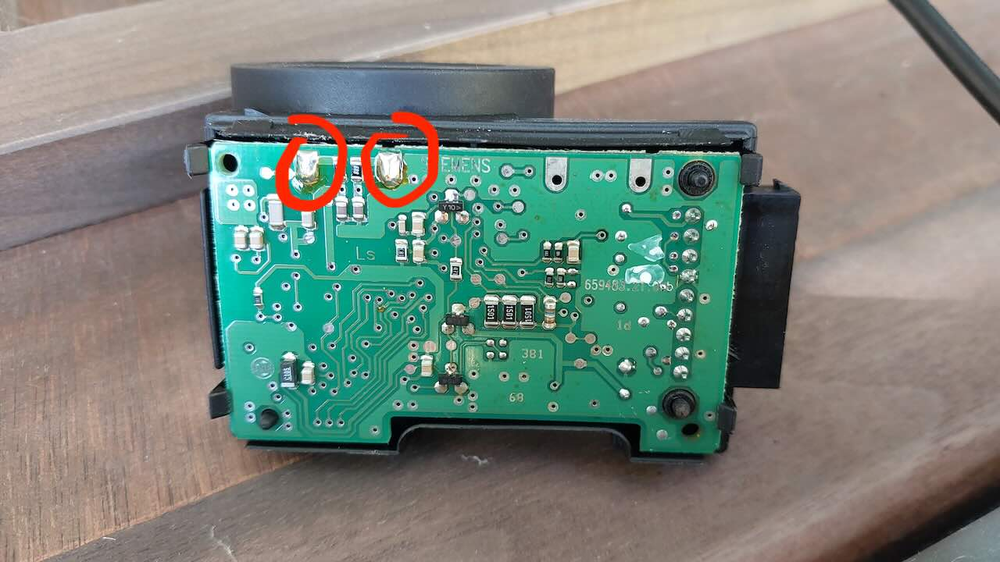
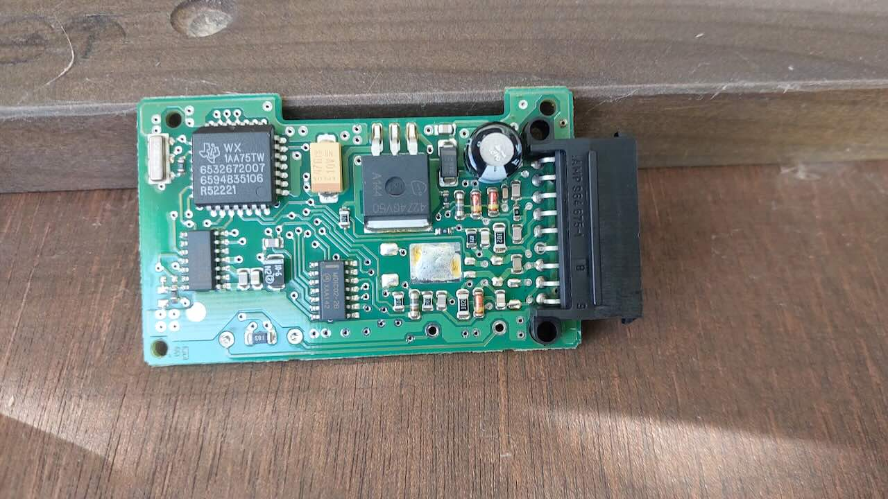
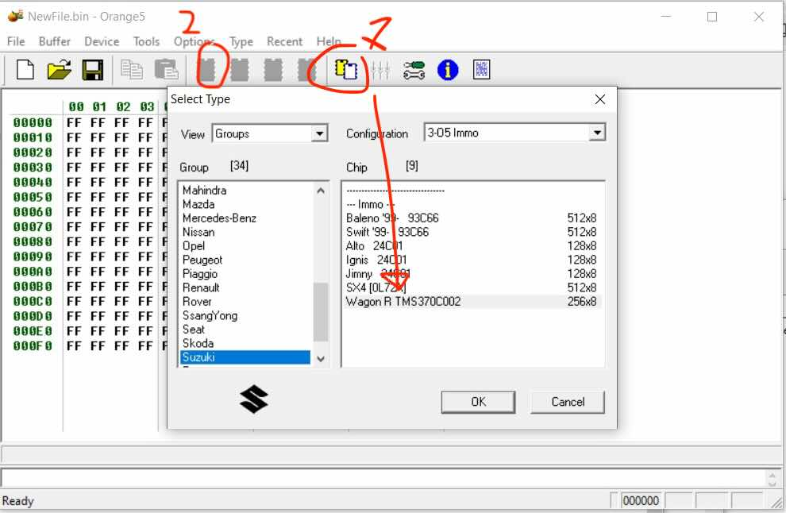
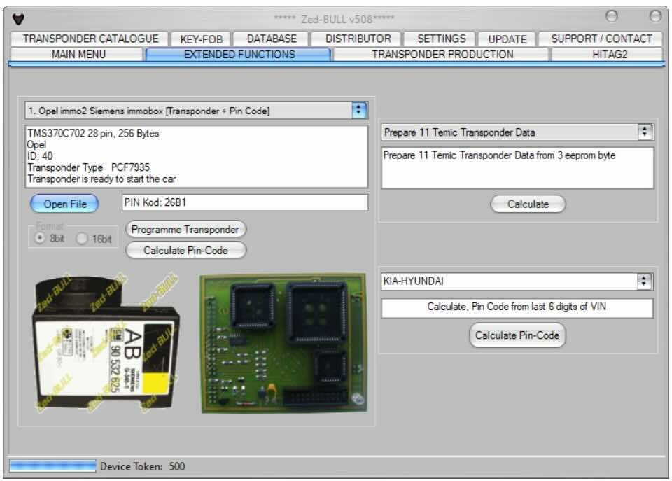

# The car
I recently got my first car, a Suzuki Wagon R+, from 2002. It's great! But it's also a slighty weird car. 

One of the weirdnesses is that it's not completely a Suzuki car, some of the electronics are from Opel, Siemens, and other European manufacturers; the car was made in Europe.

## Background

The car came with 1 key when I bought it, and no documentation, and so I thought to myself "Can't be so hard to make a second key, right?" - well, apparently it can, so this post is a quick overview of what I did and mistakes.

For the physical blade of the key, there's services where you take a photo of your key, send it off, and they cut you a matching one. I got mine from AliExpress for about 10€. Fits great and opens all the locks and turns the ignition. But it doesn't start the car yet, the car just cranks forever (like it doesn't have fuel). One lesson learned from all of this though: take a photo of your car key (good lighting, straight down), it'll enable you to get a cheap key from AliExpress.

As a background, most "modern" cars (after 2000 or so), come with something called an immobilizer. Which is a small chip ("transponder") housed inside the car key plastic shell, which the car talks to before allowing the engine to run, in order to verify the right key is present. This makes it impossible to start the car with only a physical key blade that fits the ignition lock, as you need to "pair" the key with the chip in the key with the car. Note this is separate from any wireless unlocking that the remote may have.

### First attempt
I first read that it's possible to "clone" some transponders, i.e. read it with a dedicated tool, and then create a new one which presents itself to the car as being identical. It seems like most transponder chips are cloneable this way, with a variety of tools.
 
So I bought an Xhorse Mini Key tool (the one that connects over bluetooth). This one then told me that the transponder in my key was not cloneable:

Ah well, I could have probably found this out beforehand, with a bit more googling to figure out what my car has (poorly documented, and hard to find info), and whether it would be cloneable (turns out xhorse does have [a list](http://blog.xhorsetool.com/vvdi-key-tool-transponder-type-list/), and this id40 is not in there)

### Mistake

Then poking through the app, I saw it has a "generate transponder" option. Maybe that was what I needed? So I sort of mindlessly clicked it, proceeded through (with my only original, working key in the slot), and then afterwards had a bit of an "oh shit" moment, did.  And turns out the key didn't start the car anymore :-(

Turns out that this option overwrites the transponder chip that you give it, turning it into a blank one. Somehow I had expected these to be "write once", but apparently not and you can erase them.

Ah well, expensive mistake I guess, lets call a local locksmith, they'll have all the tools and can fix this quickly. And it's low effort because I have the key blade already.

But turns out that nobody wants to work on this car, becasue well, it's weird and uncommon, with its mix of Suzuki and European electronics, and it being quite uncommon. It seems like some local businesses will do keys for french Renaults all day, but not this. One said "300€" (ouch). Has to be possible to fix this cheaper, right?

### Why is everything in this car-key ecosystem so rubbish?

The next realization is that everything in this universe is somehow a bit sleazy and rubbish, _and_ very poorly documented. Starting with the xhorse tool: It has a very chinese feeling app which demands a bunch of permissions, requires an account to use the hardware (why?), made me watch through an ad when opening it, and feels like it really wants me to buy all their other products. Why is there no open source app which can utilize the nice chinese hardware, like there is for so many other devices?

Anyway, the next thing, to stuff being poorly documented: there is literally _no_ other information pertaining to this car, or a report of someone who made a key for it. So it seems like all the professionals who do it keep the info to themselves, and there's no useful repository of information anywhere, such as what tools work or don't work, how-to's, etc.

And the last thing: all the tools a bit sleazy and slightly rubbush: you have a choice of somewhat expensive newer chinese tools (the xhorse being one), which seems legit but have annoying account requirements, and you have older chinese tools, which are often clones of even older europe-made tools. We'll get to that...

### Researching solutions:

Since I was unwilling to spend 300€ for something that I could probably do much cheaper myself (and even for 300€, getting someone to come out to the countryside, especially in France, is annoying).

So the logical next solution that I ended up spending time researching was tools that would plug into the OBD port, and which (as I understand it) tells the car that "hey, here's your new key with new transponder". That's what the "generate transponder" in the xhorse tool would have made, a blank transponder for use in this way.

There's a few options:

**SBB** / **CK100**:

these are about 50-100€ on aliexpress, and both _claim_ to support this car in their list of supported cars. I was slightly skeptical of this claim, because:

* The car's mixed electronics, with only some parts being Suzuki made, and the rest being Opel and others. Basically no confirmations that I could find of someone having tried it and confirmed that it would work.
* Me not having the "security code" (car came without documentation), which seems in some cases could be needed, as something to type into the tool to authorize the creation of new keys (?). Again poorly documented, with no info findable.
* a slight fear of being able to "brick" the car: if the tool writes bad data to the car's computer that causes it to be completely broken, then we're much worse off than before. Things like firmware updates on 20yr old devices that go wrong in all sorts of ways come to mind.

**Autel KM100**

A newer Chinese tool which can talk to the OBD port, and _also_ claims to support this car. I skipped this because:

* Same concerns about mixed electronics, and lack of security code, and briking. But also
* Autel's customer support told me that it supports this car, and does so without needing a security code (even with giving them the VIN and the part numbers of the ECU and immobilizer). But it still seemed like this could be a scripted answer and not actually true. I will never know.
* expensive and hard(er) to resell: this one is 350€ (depending on where you buy it), _and_ you need to tie it to an Autel account. If you want to remove the account and transfer it to someone else, you have to _ask the customer service_, and tell them who you want to transfer it to, and give them proof of purchase.. yuck. That sort of feels like you're using a device but don't really own it. If customer service didn't respond, then i'd be stuck with an expensive device that would be unusable. It als makes buying a used one to save money have the same problem, since I can't be sure that the seller is able or willing to transfer the device to my account. So I gave up on this idea

**EEPROM reading**

The other third option is to take a dump of the configuration memory of the microcontroller in the car's immobilizer module, and then make matching keys (transponder chips) corresponding to that data. That's in the next section:

### The solution I ended up with:

You basically need two tools, one to read the data off the eeprom, and then another to make a transponder with that data.

For **reading the eeprom**, for some cars you can use very common and cheap eeprom reader tools (€5 range), but unfortunately not this one, because the eeprom seems to be built into the microcontroller, so you need a specific tool to read it.

I went with an Orange5 clone from Aliexpress, about €80, making sure that it supported TMS370 (there's a few variants), since that was what would potentially be in mine. Which was the right choice. 
But we're coming back to the "sleazy" part here, because while it's cheap (80€), it's cheap because it's "clone" hardware, where the chinese manufacturer copied the hardware, and then ships it with the software developed by a Bulgarian developer who developed the original thing. So I apologize to whoever created the original, that I can't afford it and bought the clone instead :-(

(There's other dedicated tools for tms370 only, which are cheaper, seem less nice, and which I did not try.)

Anyway, it arrived, and worked! Approx steps for reading the eeprom, and then using the file, are:

**disconnect battery**: It's best to disconnect the negative side, so that it's less likely to create a short circuit involving the wrench you're using in the process.

**Dismantle the steering column cover and remove the unit**: You need to remove the plastic covers, which will reveal the immobilizer unit. Then disconnectthe cable going to the right stalk (wipers), and the cable going to the immobilizer unit (this one is a bit though). Then insert the key into the ignition, turn it to the "acc" position, and then poke with a thin screwdriver or similiar in the little hole on the top side, which will enable you to pull out the lock cilynder. After that you can fiddle off the immobilizer as well. It looks like this:

(Markings for future googlers: Siemens WFS Opel2 24 445 098 5Wk4 763 E-491-42)

(and if you have no keys left: good luck, thankfully I didn't have to do that). 

Photo of disassembly: 1 is the cables you have to disconnect to get to the little release hole, 2 is the hole you need to poke.

**desolder the coil and free the board**

Next, you need to free the circuit board. First remove the cover with the label (4 clips), which will reveal the underside of the circuit board. Here you need to desolder the two wires going to the circular coil, while wiggling the board to free it:

.

Then you will see the side of the board with the MCU:

(Part number for googlers: Texas Instruments WX 1AA75TW 6532672007 6594836106 R52221). This one is a TMS370. It seems like there is also a variant with a different controller, documented on [iamcarhacker](https://iamcarhacker.com/procedures/programming/key-programming/how-to-read-the-immo-code-car-pass-from-an-opel-vauxhall-immo-2/) ([web archive in case it disappears](https://web.archive.org/web/20260919160621/https://iamcarhacker.com/procedures/programming/key-programming/how-to-read-the-immo-code-car-pass-from-an-opel-vauxhall-immo-2/)). I _think_ that this is the older one, so these ones (green label and no mention of "VDO" ), will contain TMS370 (and need a tms370 capable tool), and the newer "VDO" ones with orange label will contain the Motorola HC908AB16A that iamcarhacker found.

I bought the Orange5 because it claims to support both.

**desolder the chip**

next step is to desolder the chip. No photos here, but I'd recommend only doing this whole process if you're comfortable with it. Hot air required, not particularly difficult (experience required thoug!)

**read eeprom with orange5**.

Place the chip in the adapter supplied with orange5, the corner with the small diagonal cutout aligned with the similar diagonal corner in the reader. Sorry, no photo, but there's someone else's video of the process here: https://www.youtube.com/watch?v=hjcDguZOhrQ

Then, connect orange5, install drivers (mostly just worked for me, I had to go in device manager and do "update driver" and select the supplied one), then press "configuration" (1. in the screenshot) there select the "Suzuki Wagon R" option, then "read" (2. in the screenshot).

.

Once you have data in the window, save it to a .bin file somewhere. Try reading it several times to make sure you get the same data, to make sure it's good.

(My Orange5 Unit came with a CD, the contents of which I won't distribut here since it's likely copyright infringement. But the name of the contained file is _烧录器5.rar_ sha256: 3d83e28361dd8cea6f388e3e871704256fff0c3cf568a46a1f8254a4ee4a67bc). It has the software and drivers, all of which worked on the first try.)

**Create new transponder using the file**. For this you need a tool which can be used with a PC, and write to a transponder, based on the data in the eeprom .bin file.

* pricier, but better and "legit": TMPRO. [Their page lists support for this box](https://tmpro2.com/software-modules-description-and-prices/) but it's pricier and unclear how hard it is to "resell" the license afterwards.
* Zed Bull: much cheaper, but this seems yet another case where the chinese manufacturer ripped off the hardware and ship it with software made by someone else. So sorry to whoever made the software, that I bought the clone of...

So anyway, I went with zedbull, this is a bit trickier to get working:

* This one came with a CD wit software, which you can probably also find the contents of elsewhere.

* Connect USB, install driver via device manager -> update driver, install the driver shipped with it

* Install dotnet framework 3.5 (download from microsoft)

* installl zedbull v506 software.

* go to program files (x86), and then in the folder where you installed it, "properties", and make it modifieable by "anyone". Otherwise it does not work correctly. Running as administrator might also make it work

* In my case, now it would run, but always always show an error "Device not responding" when connecting to the COM port. The fix for this is also supplied on the CD, in the form of a v508 software folder. The contents of this needs to be copied into the installation directory, overwriting what is already there (from the v506 install). There's a PDF with instructions for that on the CD as well.

Then it finally works, and you can set it to "english" in the main menu tab, connect device (main menu also), then go to "extended functions":

Here you can select "Opel immo2 siemens immbox", then "open file" to choose the file you saved from orange5 earlier, and then "program transponder". And then hopefully you will have a transponder/key that starts your car! (once you resolder the chip to the immobiliser module and put everything back together).

Some other notes and recommendations:

* With the software being not quite legit, I would run this stuff on a throway install or VM.
* I bought plain pcf7935 transponders, as well as ones marketed as "opel id40". all worked.
* this might also work for the opel agila or vauxhall agila, since they seem to use similar electronics. Beware that they might be not using the tms370 microcontroller.
* In the end this is about 150€ for both the orange5 and the zed bull, and both don't have any account requirements etc and can be resold. So it's a cheap second key (if you are comfortable soldering the IC and have time on your hands)

Anyway, hopefully this is usefull for someone who has the same problem of wanting to DIY keys for their (until now), poorly documented Wagon R.